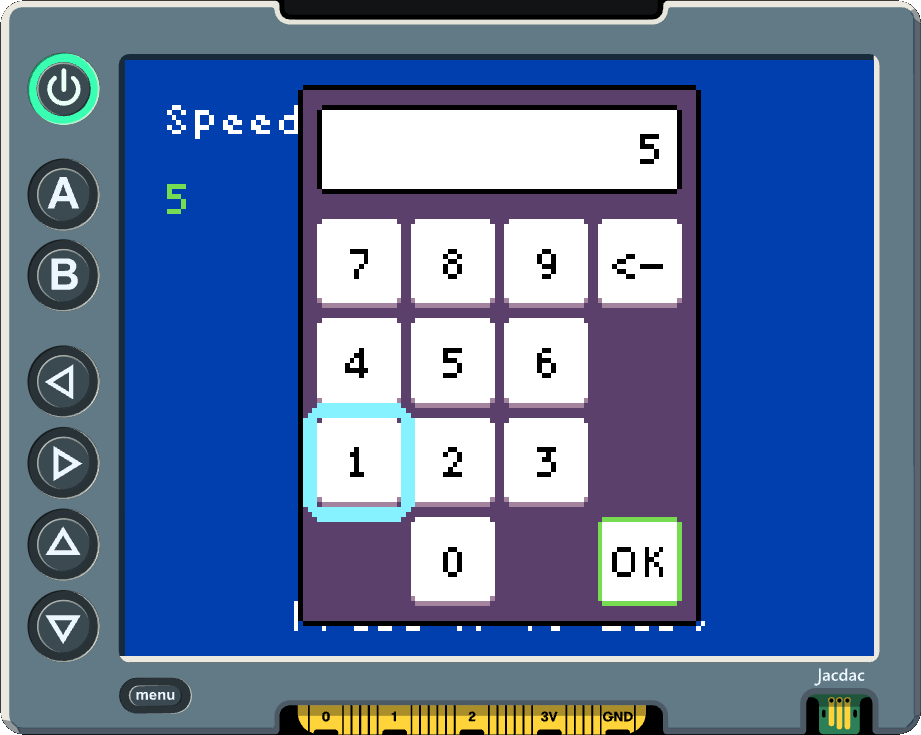
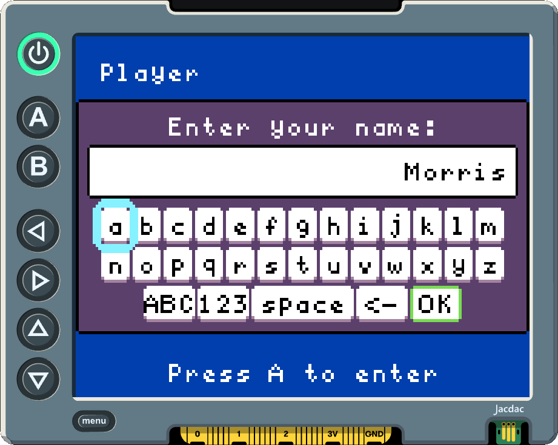
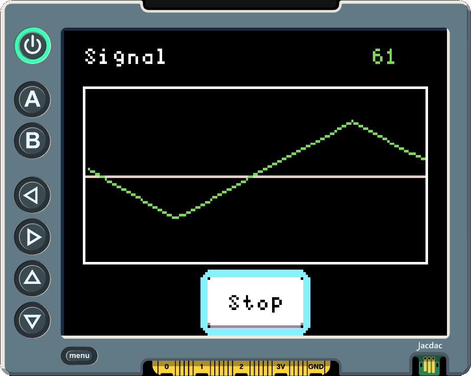

# **micro:bit apps UI** (user-interface-base)

**micro:bit apps UI** is a small UI toolkit for building [micro:bit apps](https://microbit-apps.org/): apps that run on the [BBC micro:bit](https://microbit.org/) + [Display Shield](https://microbit-apps.org/getting-started/display-shields/).

## The Short Version

**micro:bit apps UI** gives an app a small screen runtime:

- Draw in a fixed `160x120` pixel coordinate space.
- Put each app page in a `UiScreen`.
- Push screens onto one `UiRuntime`.
- Queue semantic input events such as `up`, `down`, `activate`, and `cancel`.
- Start the runtime to deliver input, update the active screen, render it, and
  commit frames to the Display Shield.

You can draw directly in a screen, add screen-owned focusable views, or open
modal UI such as the built-in numeric keypad.

## 1. Draw In Display Coordinates

The Display Shield is `160x120` pixels. **micro:bit apps UI** uses that same
coordinate space, with `(0, 0)` at the top-left corner.

```ts
class HelloScreen extends ui.UiScreen {
    public render(surface: ui.DrawSurface): void {
        surface.drawText("Hello", 19, 11, { color: 3 })
        surface.drawRect(new ui.Rect(4, 4, 60, 22), 7)
        super.render(surface)
    }
}
```

All drawing methods use palette color indices. The default palette matches
[MakeCode Arcade's default palette](https://arcade.makecode.com/reference/scene/background-color).
Text, bitmaps, rectangles, lines, and circles are drawn through the `DrawSurface`
passed to `render()`.

## 2. Start A Runtime

A typical app creates one runtime, pushes the first screen, and starts the
runtime.

```ts
const runtime = new ui.UiRuntime({
    display: new ui.DisplayShieldFrameAdapter(),
    clearColor: 1,
})

runtime.push(new HelloScreen())
runtime.start()
```

`start()` registers a frame handler with the current MakeCode event context. It
delivers queued input to the active screen, calls the
screen's `update()`, calls `render()`, and commits the frame to the display
adapter. Call `stop()` when the app should stop drawing UI frames.

## 3. Make A Screen Own App State

Screens are the normal place to keep page state and respond to input. Use
`handleInput()` when the screen wants first chance at an event.

```ts
class CounterScreen extends ui.UiScreen {
    private count: number
    private countLabel: ui.UiLabel

    constructor() {
        super()
        this.count = 0
        this.backgroundColor = 0
        this.add(new ui.UiLabel("Count:", 1), { x: 8, y: 8 })
        this.countLabel = new ui.UiLabel("0", 7)
        this.add(this.countLabel, { x: 8, y: 24 })
    }

    public handleInput(event: ui.UiInputEvent): boolean | undefined {
        if (event.phase == "released") return undefined

        if (event.action == "activate") {
            this.count += 1
        } else if (event.action == "cancel") {
            this.count = 0
        } else {
            return undefined
        }

        this.countLabel.setText("" + this.count)
        return true
    }
}
```

Returning `true` from `handleInput` means the screen handled the event.
Returning `undefined` lets **micro:bit apps UI** try focus routing. While a
modal is open, the modal receives input before the screen.

## 4. Input

The runtime works with semantic actions, not specific buttons. A
`UiInputEvent` names what the user meant to do: `up`, `down`, `left`, `right`,
`activate`, `cancel`, or `menu`.

Input events can also include a `source` such as `microbitButton`,
`displayShieldController`, `keyboard`, or `synthetic`, and a `phase` such as
`pressed`, `released`, or `repeated`. Most screens only need `action`; use
`phase` when release events or key repeat should behave differently from the
initial press.

Call `runtime.dispatchInput()` from hardware callbacks, test code, or adapter
code. The runtime queues those events and delivers them on the next frame. When
no modal is open, the active screen gets first chance through `handleInput()`,
then the runtime tries focus routing when the screen returns `undefined`.

## 5. Map micro:bit Input To Actions

Map micro:bit button callbacks to the semantic actions your UI uses.
For example, a simple two-button app can use A as activate and B as cancel.

```ts
input.onButtonPressed(Button.A, function () {
    runtime.dispatchInput({
        action: "activate",
        source: "microbitButton",
    })
})

input.onButtonPressed(Button.B, function () {
    runtime.dispatchInput({
        action: "cancel",
        source: "microbitButton",
    })
})
```

## 6. Add Labels And Buttons

`UiLabel` is the simplest way to keep text on a screen without writing a custom
`render()` method. `UiButton` owns activation and focus. Both are placed with
`add()`.

```ts
class StartScreen extends ui.UiScreen {
    private status: "Ready" | "Started" | "Stopped"
    private statusLabel: ui.UiLabel
    private toggleButton: ui.UiButton

    constructor() {
        super()
        this.status = "Ready"
        this.statusLabel = new ui.UiLabel(this.status, 1)
        this.toggleButton = new ui.UiButton("start", "Start", () => {
            this.status = this.status == "Started" ? "Stopped" : "Started"
            this.statusLabel.setText(this.status)
            this.toggleButton.setText(
                this.status == "Started" ? "Stop" : "Start",
            )
        })
        this.add(this.statusLabel, { x: 8, y: 8 })
        this.add(this.toggleButton, { centerX: 80, centerY: 60 })
    }
}
```

Use `UiButtonView` directly only when you need the lower-level renderer. For
custom reusable controls, implement a `UiFocusableView` and add it to a screen
with `add()` or `addCentered()`. The screen will arrange it, register its focus
targets, route input to it, and render it each frame.

When a fixed control size is needed, use `size: { width, height }` on a single
button or label. Pickers use `controlSize: { width, height }` for repeated
control cells.

## 7. Open A Numeric Keypad

**micro:bit apps UI** includes a modal keypad for number entry. For positive
integer entry, open it from a screen with an initial value and a completion
handler.

```ts
class SettingsScreen extends ui.UiScreen {
    private speed: number
    private speedLabel: ui.UiLabel

    constructor() {
        super()
        this.speed = 5
        this.backgroundColor = 8
        this.add(new ui.UiLabel("Speed", 1), { x: 8, y: 8 })
        this.speedLabel = new ui.UiLabel("" + this.speed, 7)
        this.add(this.speedLabel, { x: 8, y: 24 })
        this.add(new ui.UiLabel("Press A to Edit", 1), {
            centerX: 80,
            y: 108,
        })
    }

    public handleInput(event: ui.UiInputEvent): boolean | undefined {
        if (event.action == "activate" && event.phase != "released") {
            this.openSpeedEditor()
            return true
        }

        return undefined
    }

    private openSpeedEditor(): void {
        this.openModal(
            new ui.UiNumericEntryModal("speed-editor", this.speed, value => {
                this.speed = value
                this.speedLabel.setText("" + value)
            }),
        )
    }
}
```
<p align="center">
    
</p>

While a modal is open, the screen routes input to the modal first. The numeric
keypad uses the same semantic input actions as the rest of the runtime. OK emits
a `completed` result and closes the modal automatically. If a screen overrides
`render()`, call `super.render(surface)` after drawing the screen background and
content. The base render method draws screen-owned views and the active modal on
top of the screen.

## A Few Working Rules

- Prefer semantic input events inside screens instead of checking physical
  buttons in every screen.
- Keep one runtime for the app and push, pop, or replace screens as the user
  moves through the app.
- Reuse `Rect`, `Size`, and `UiMeasuredSize` objects in frame code when practical. Avoid allocations in the render callback.
- Use screen modals for short blocking tasks such as number entry and confirmation dialog.

## Using **micro:bit apps UI**

**micro:bit apps UI** is a MakeCode extension. There are two normal ways to use it:

- **Work in the MakeCode Editor** when you want the in-editor project workflow.
- **Work in VS Code** when you want files on disk, source control, and command-line
  builds.

### Workflow 1: MakeCode Editor

Use this workflow when you want to build in the browser and let MakeCode manage
the project.

You need:

- The [MakeCode editor for micro:bit](https://makecode.microbit.org).
- A [BBC micro:bit](https://microbit.org/) and [Display Shield](https://microbit-apps.org/getting-started/display-shields/) when you want to run on hardware.

To add **micro:bit apps UI**:

1. Open `https://makecode.microbit.org` and create or open a project.
2. Open the Extensions window from the toolbox.
3. Paste this repository URL into the extension search box:

    ```text
    https://github.com/microbit-apps/user-interface-base
    ```

4. Select the extension when MakeCode finds it.
5. Switch to JavaScript view and use the `ui` namespace.
6. The extension's toolbox category will be labeled `**micro:bit apps UI**`.

### Workflow 2: VS Code

Use this workflow when you want a local project folder that can be edited in
VS Code and built from the command line.

You need:

- [VS Code](https://code.visualstudio.com/download)
- [Node.js and npm](https://nodejs.org/en/download)
- The
  [Microsoft MakeCode Arcade VS Code extension](https://marketplace.visualstudio.com/items?itemName=ms-edu.pxt-vscode-web).
  Despite the name, it also works for micro:bit projects and is especially
  useful for running the MakeCode simulator from VS Code.
- The MakeCode command-line tool:

    ```sh
    npm install -g makecode
    ```

- A BBC micro:bit and Display Shield when you want to run on hardware.

To create a new local micro:bit project:

```sh
mkc init microbit
mkc add https://github.com/microbit-apps/user-interface-base user-interface-base
mkc build
```

Then open the folder in VS Code. Use the MakeCode icon in the activity bar to
open the MakeCode Action Palette. From there you can start the MakeCode simulator, install project
dependencies, add extensions by GitHub URL, and
build for hardware.

To add **micro:bit apps UI** to an existing local project, run this from the project
folder:

```sh
mkc add https://github.com/microbit-apps/user-interface-base user-interface-base
mkc build
```

If you add the extension from VS Code instead, use the MakeCode Extension's
Add an Extension command and paste:

```text
https://github.com/microbit-apps/user-interface-base
```

You can also edit the app's `pxt.json` directly:

```json
{
    "dependencies": {
        "micro:bit apps UI": "github:microbit-apps/user-interface-base#v0.0.47"
    }
}
```

After editing `pxt.json` by hand, download dependencies and build:

```sh
mkc install
mkc build
```

## More Examples

These examples show more small patterns you can copy into an app.

### Using App-Owned Bitmaps Or Text in UI

Controls can refer to bitmaps and labels by id. Provide an asset resolver when
the runtime is created.

```ts
class AppAssets implements ui.UiAssetResolver {
    public getBitmap(
        id: string | number,
        nullIfMissing?: boolean,
    ): Bitmap | undefined {
        if (id == "start") {
            return bmp`
                . 7 .
                7 7 7
                . 7 .
            `
        }

        if (nullIfMissing) return undefined
        return bmp`.`
    }

    public getText(id: string): string {
        if (id == "startLabel") return "Start"
        return ""
    }
}

const runtime = new ui.UiRuntime({
    display: new ui.DisplayShieldFrameAdapter(),
    assets: new AppAssets(),
})
```

Screens can also keep bitmaps and strings as fields. Asset resolvers are most
useful when reusable controls need stable ids instead of direct values.

### Confirmation Dialog

Use `UiPicker` for simple modal choices. It owns modal focus, button layout,
directional navigation, rendering, activation, and cancel handling.

```ts
class SaveScreen extends ui.UiScreen {
    private status: string
    private statusLabel: ui.UiLabel

    constructor() {
        super()
        this.status = "Not saved"
        this.backgroundColor = 8
        this.statusLabel = new ui.UiLabel(`Status: ${this.status}`, 7)
        this.add(this.statusLabel, { x: 8, y: 8 })
        this.add(new ui.UiLabel("Press A to save", 1), { x: 8, y: 18 })
    }

    public handleInput(event: ui.UiInputEvent): boolean | undefined {
        if (event.action == "activate" && event.phase != "released") {
            this.openConfirmDialog()
            return true
        }

        return undefined
    }

    private openConfirmDialog(): void {
        const modal = new ui.UiPicker(
            "save-dialog",
            "Save changes?",
            ["Cancel", "OK"],
            choice => {
                this.status = choice == "OK" ? "Saved" : "Cancelled"
                this.statusLabel.setText(`Status: ${this.status}`)
            },
            () => {
                this.status = "Cancelled"
                this.statusLabel.setText(`Status: ${this.status}`)
            },
        )

        this.openModal(modal)
    }
}
```

### Text Entry Modal

Use `UiTextEntryModal` for short strings such as names, labels, or titles. The
modal owns the compact keyboard, and the screen updates its state when the modal
returns a completed result.

```ts
class NameEntryScreen extends ui.UiScreen {
    private name: string
    private nameLabel: ui.UiLabel

    constructor() {
        super()
        this.name = ""
        this.backgroundColor = 8
        this.add(new ui.UiLabel("Player", 1), { x: 8, y: 8 })
        this.nameLabel = new ui.UiLabel("No name", 7)
        this.add(this.nameLabel, { x: 8, y: 24 })
        this.add(new ui.UiLabel("Press A to enter", 1), {
            centerX: 80,
            y: 108,
        })
    }

    public handleInput(event: ui.UiInputEvent): boolean | undefined {
        if (event.action == "activate" && event.phase != "released") {
            this.openNameEditor()
            return true
        }

        return undefined
    }

    private openNameEditor(): void {
        this.openModal(
            new ui.UiTextEntryModal({
                modalScopeId: "name-editor",
                title: "Enter your name:",
                initialText: this.name,
                allowWhitespace: true,
                allowSymbols: true,
                maxLength: 16,
                onResult: result => {
                    if (result.kind == "completed") {
                        this.name = result.text
                        this.nameLabel.setText(
                            this.name.length ? this.name : "No name",
                        )
                    }
                },
            }),
        )
    }
}
```
<p align="center">
    
</p>

### Animated Data Graph

For custom visualization, keep the data and controls in the screen, update it
over time, and draw directly to the `DrawSurface`.

```ts
class DataGraphScreen extends ui.UiScreen {
    private values: number[]
    private tick: number
    private graphRect: ui.Rect
    private valueLabel: ui.UiLabel
    private toggleButton: ui.UiButton
    private running: boolean

    constructor() {
        super()
        this.backgroundColor = 0
        this.tick = 0
        this.running = true
        this.graphRect = new ui.Rect(8, 22, 144, 70)
        this.add(new ui.UiLabel("Signal", 1), { x: 8, y: 6 })
        this.toggleButton = new ui.UiButton("toggle", "Stop", () => {
            this.running = !this.running
            this.toggleButton.setText(this.running ? "Stop" : "Start")
        })
        this.values = [
            24, 28, 35, 40, 46, 52, 58, 63, 68, 72, 70, 66, 60, 54, 48, 42, 36,
            31, 27, 25,
        ]
        this.valueLabel = new ui.UiLabel(
            "" + this.values[this.values.length - 1],
            7,
        )
        this.add(this.valueLabel, { x: 128, y: 6 })
        this.add(this.toggleButton, { centerX: 80, centerY: 107 })
    }

    public update(): void {
        if (!this.running) return

        this.tick += 1
        if (this.tick % 6 != 0) return

        const phase = Math.idiv(this.tick, 6) % 20
        const wave = phase < 10 ? phase : 20 - phase
        this.values.removeAt(0)
        this.values.push(25 + wave * 6)
        this.valueLabel.setText("" + this.values[this.values.length - 1])
    }

    public render(surface: ui.DrawSurface): void {
        surface.drawRect(this.graphRect, 1)
        surface.drawLine(
            this.graphRect.x + 1,
            this.graphRect.y + Math.idiv(this.graphRect.height, 2),
            this.graphRect.x + this.graphRect.width - 2,
            this.graphRect.y + Math.idiv(this.graphRect.height, 2),
            13,
        )

        let previousX = 0
        let previousY = 0
        for (let i = 0; i < this.values.length; i++) {
            const x =
                this.graphRect.x +
                2 +
                Math.idiv(
                    i * (this.graphRect.width - 4),
                    this.values.length - 1,
                )
            const y =
                this.graphRect.y +
                this.graphRect.height -
                3 -
                Math.idiv(this.values[i] * (this.graphRect.height - 6), 100)

            if (i > 0) surface.drawLine(previousX, previousY, x, y, 7)
            previousX = x
            previousY = y
        }

        super.render(surface)
    }
}
```
<p align="center">
    
</p>

## Existing Projects

These micro:bit apps projects use user-interface-base and are useful references
when you want to see the library in action:

- [microcode-v2](https://github.com/microbit-apps/microcode-v2)
- [microdata](https://github.com/microbit-apps/microdata)
- [microgui](https://github.com/microbit-apps/microgui)
